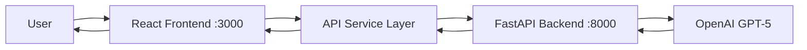
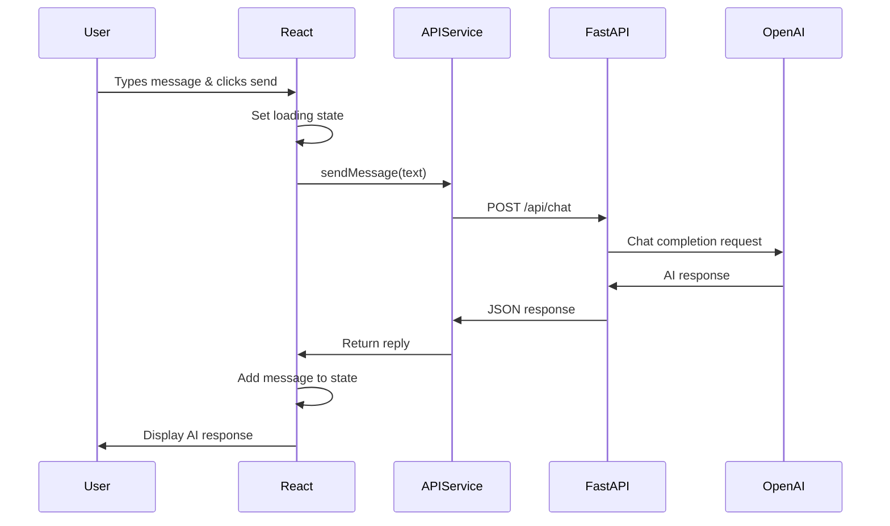

# Frontend-Backend Integration Plan

## Overview
Connect the React frontend (Create React App) with the FastAPI backend to create a functional mental coach chatbot application.

## Current Architecture Analysis

### Backend (FastAPI)
- **Location**: [`/api/index.py`](../api/index.py)
- **Framework**: FastAPI with CORS enabled
- **Port**: 8000 (default)
- **Key Endpoint**: `POST /api/chat`
  - Request: `{ "message": "string" }`
  - Response: `{ "reply": "string" }`
- **AI Model**: OpenAI GPT-5 (mental coach persona)
- **CORS**: Configured to allow all origins (`*`)

### Frontend (React)
- **Location**: [`/frontend`](../frontend)
- **Framework**: Create React App (React 19.2.4)
- **Port**: 3000 (default)
- **Current State**: Basic boilerplate with no custom components

## Integration Architecture



## Implementation Plan

### 1. Create API Service Layer
**File**: [`frontend/src/services/api.js`](../frontend/src/services/api.js)

**Purpose**: Centralize all backend communication logic
- Create a service module to handle HTTP requests
- Implement `sendMessage(message)` function
- Use native `fetch` API (no additional dependencies needed)
- Handle API base URL configuration
- Include error handling for network failures

**Key Functions**:
- `sendMessage(message)` - POST to `/api/chat`
- Error handling wrapper
- Response parsing

### 2. Add Environment Configuration
**File**: [`frontend/.env.development`](../frontend/.env.development)

**Purpose**: Configure API endpoint URL for different environments
- Create `.env.development` for local development
- Set `REACT_APP_API_URL=http://localhost:8000`
- Add `.env.production` for production deployment (if needed)

**Note**: React requires environment variables to be prefixed with `REACT_APP_`

### 3. Create Chat UI Component
**File**: [`frontend/src/components/Chat.js`](../frontend/src/components/Chat.js)

**Purpose**: Main chat interface component

**Features**:
- Message list display with scrollable container
- Message bubbles (user messages on right, AI on left)
- Input field with send button
- Loading state while waiting for AI response
- Error message display
- Auto-scroll to latest message

**State Management**:
- `messages` - Array of message objects `[{ text, sender, timestamp }]`
- `inputValue` - Current input field value
- `isLoading` - Loading state during API call
- `error` - Error message if API call fails

**Component Structure**:
```
Chat
├── MessageList
│   └── Message (user/ai variants)
├── InputArea
│   ├── TextInput
│   └── SendButton
└── ErrorDisplay (conditional)
```

### 4. Create Chat Styles
**File**: [`frontend/src/components/Chat.css`](../frontend/src/components/Chat.css)

**Purpose**: Style the chat interface

**Design Elements**:
- Clean, modern design
- Distinct styling for user vs AI messages
- User messages: right-aligned, blue background
- AI messages: left-aligned, gray background
- Responsive layout
- Smooth scrolling
- Input area fixed at bottom
- Loading indicator animation

### 5. Update Main App Component
**File**: [`frontend/src/App.js`](../frontend/src/App.js)

**Purpose**: Integrate Chat component into main app

**Changes**:
- Remove boilerplate content
- Import and render Chat component
- Update app title/header for mental coach theme
- Minimal wrapper styling

### 6. Update App Styles
**File**: [`frontend/src/App.css`](../frontend/src/App.css)

**Purpose**: Update main app styling

**Changes**:
- Remove default Create React App styles
- Add container styling for chat
- Ensure full-height layout
- Add mental coach theme colors

### 7. Error Handling & Loading States

**Error Scenarios to Handle**:
- Network connection failures
- Backend server not running
- OpenAI API errors (from backend)
- Invalid responses
- Timeout errors

**Loading States**:
- Show loading indicator while waiting for AI response
- Disable input during loading
- Display "AI is typing..." indicator

### 8. Testing Strategy

**Manual Testing Checklist**:
- [ ] Backend server starts successfully on port 8000
- [ ] Frontend starts successfully on port 3000
- [ ] Can send a message and receive AI response
- [ ] User messages appear on the right
- [ ] AI messages appear on the left
- [ ] Loading state displays correctly
- [ ] Error handling works when backend is down
- [ ] Messages scroll automatically
- [ ] Input clears after sending
- [ ] Multiple messages work correctly

**Test Scenarios**:
1. Happy path: Send message → Receive response
2. Error path: Backend down → Show error message
3. Edge cases: Empty message, very long message
4. Performance: Multiple rapid messages

### 9. Documentation Updates

**Files to Update**:
- [`frontend/README.md`](../frontend/README.md) - Add setup instructions
- Root [`README.md`](../README.md) - Add full-stack setup guide

**Documentation Sections**:
- Prerequisites (Node.js, Python, OpenAI API key)
- Backend setup and running instructions
- Frontend setup and running instructions
- Environment variable configuration
- Testing the integration
- Troubleshooting common issues

## File Structure After Implementation

```
frontend/
├── public/
├── src/
│   ├── components/
│   │   ├── Chat.js          [NEW]
│   │   └── Chat.css         [NEW]
│   ├── services/
│   │   └── api.js           [NEW]
│   ├── App.js               [MODIFIED]
│   ├── App.css              [MODIFIED]
│   ├── index.js
│   └── index.css
├── .env.development         [NEW]
├── package.json
└── README.md                [MODIFIED]
```

## Environment Setup

### Backend
```bash
# From project root
uv sync
uv run uvicorn api.index:app --reload
```

### Frontend
```bash
# From project root
cd frontend
npm install
npm start
```

## API Communication Flow



## Key Considerations

### CORS
- Backend already configured with `allow_origins=["*"]`
- No additional CORS configuration needed for local development

### State Management
- Using React hooks (`useState`, `useEffect`)
- No external state management library needed for this simple app

### Styling Approach
- Plain CSS (no CSS-in-JS or preprocessors)
- Keeps dependencies minimal
- Easy to customize

### Error Messages
- User-friendly error messages
- Technical details logged to console
- Retry mechanism for failed requests

### Performance
- Debouncing not needed (user clicks send button)
- Auto-scroll optimization with `useEffect`
- Message list virtualization not needed for MVP

## Success Criteria

✅ User can type a message and send it to the backend  
✅ AI response appears in the chat interface  
✅ Messages are visually distinct (user vs AI)  
✅ Loading state provides feedback during API calls  
✅ Errors are handled gracefully with user-friendly messages  
✅ Chat interface is responsive and clean  
✅ Documentation is clear and complete  

## Next Steps After Implementation

1. Add message persistence (localStorage or database)
2. Add conversation history
3. Implement typing indicators
4. Add message timestamps
5. Implement dark mode
6. Add user authentication
7. Deploy to production (Vercel for frontend, backend hosting)

## Deployment Considerations (Future)

### Frontend (Vercel/Netlify)
- Build command: `npm run build`
- Output directory: `build`
- Environment variable: `REACT_APP_API_URL` (production backend URL)

### Backend (Railway/Render/Fly.io)
- Ensure CORS allows production frontend domain
- Set `OPENAI_API_KEY` environment variable
- Use production-grade ASGI server (uvicorn with workers)

---

**Ready to implement?** Switch to Code mode to begin building the integration!
